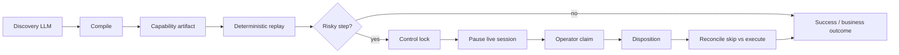
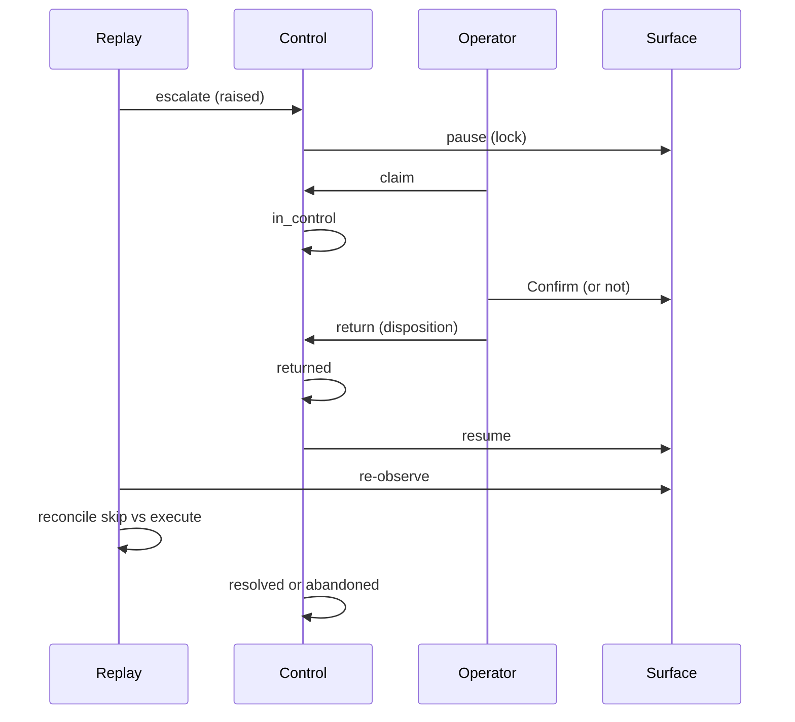

# REPORT

## 1. Architecture

RelayAI is a single Node process with five seams: **Surface**, **LLM**, **Artifact**, **Policy**, and **Control**. Discovery and replay share the Surface and Policy; only discovery calls an LLM. That is the product claim in code form: the model discovers, the artifact is the capability, replay is production.

A CLI wires the adapters. There is no queue, no service mesh, and no application database — on purpose. **Artifacts and runs are different lifecycles, so they are different stores.** Capabilities are versioned JSON in `capabilities/`, reviewed in PRs like code. Successful mutating runs append one line to `runs/ledger.jsonl`. A reviewer diffs a capability; an operator greps a ledger. Putting both in Postgres would mix an editable contract with append-only operational data.

Between sequenced capabilities, state does not live in the artifact. It lives on the **Surface** (the live browser session: URL, cookies, DOM) and in the **invocation bag** (typed outputs the caller passes to the next invoke). `uses` runs children on that same Surface, so lookup's member page is still there when file-dispute clicks Disputes. A one-shot CLI `replay` is one session; a calling agent that wants three capabilities in sequence keeps the Surface and the bag.

The Surface port (`observe` / `act` / `pause` / `resume`) is the heterogeneity boundary. Playwright implements it for this submission; a desktop adapter would not change the artifact or the replay engine. The LLM port is similarly swappable (Anthropic, OpenAI, or a scripted client for tests).

Trade-off: headed Playwright is required for a real live-session handoff, which makes unattended CI use headless plus an auto-resume waiter. I accepted that split rather than fake the session.



## 2. Artifact schema

A capability is a function, not a transcript. The schema (`schemaVersion: "1.1"`) is written so a reviewer can read one `capabilities/*.json` cold — no `engine.ts` open — and answer: what it does, what it needs, what it returns, what it breaks, and who made it.

- **Contract** — `id`, `parameters[]`, `outputs[]`, prose `description`
- **Binding** — `app.vendorId` + `surfaceKind`, not a hostname
- **Blast radius** — `sideEffects.kind`: `none` | `creates` | `mutates` | `irreversible`, plus `compensation` (what a human does to undo it). A calling agent sees this before invoke. Step notes are not the contract.
- **Preconditions** — `requiresSession`, `requiresRole`, `entryCheckpoint`. Replay asserts the entry screen *before step 1*. If file-dispute is invoked off the member record, it fails `PRECONDITION_FAILED` at the door, not on a missing Disputes link at step 4.
- **Composition** — `uses[]`. `verify-and-file-dispute` and `open-sub-account` invoke `lookup-member-savings` instead of re-recording Search. The catalog is a library.
- **Provenance** — `discoveredAt`, `discoveredBy`, `model`, `promptHash`, `evidenceRunId`. In a regulated shop, “which model wrote this, from which run” is a compliance question.
- **Per-step budget** — `timeoutMs` and `retryBudget` live on the step. The engine stays generic.
- **Steps** — ordered actions with ranked locators, optional `inputFrom`, `risk`, checkpoints
- **Exceptional states** — detectors with an explicit class (`business_outcome` | `recoverable` | `transient` | `hard_failure` | `needs_human`)
- **Anti-checkpoints** — vendor “wrong screen” text; if it holds, you are lost
- **Success** — a final checkpoint the caller can trust, plus typed outputs (`money` → `{ currency, minor }`)

If the artifact says a flow is irreversible and the caller ignores that and replays twice, two things stop it: unattended replay still will not click Confirm without `--approve-risky` or a human resume; and a successful mutating run appends the idempotency key to the ledger. A second invoke with the same key returns `IDEMPOTENCY_CONFLICT` even with `--approve-risky`. `--approve-risky` gates the click; the ledger gates the duplicate. Compensation on the artifact tells the human how to undo the first one.

**Schema migration.** `1.x` is additive. `migrate()` upgrades `1.0` → `1.1` at load (fills `sideEffects`, `preconditions`, `uses`, `provenance`, per-step timeout/retry). On-disk 1.0 files still load; migrate is a read adapter, not a rewrite of git. `2.0` is a breaking rewrite. The engine does not guess: it throws `UNSUPPORTED_SCHEMA`. The 4,000 recorded 1.x artifacts stay loadable until a dedicated 2.0 migrator exists.

Locators are a11y-first (`role` + exact `name`), then label, then text, then CSS — the compiler emits that ranked chain on every targeted step, from the observation after each action. Per-step checkpoints are derived from the observation delta (url, then title, then newly appeared text), with discovery literals stripped so member IDs do not bake into the artifact. CSS is last because legacy cores do not have test IDs and because a broad `cell` name match on a nested table will happily return the outer wrapper. Exact accessible-name matching is what made extract return `$4,250.00` instead of the entire member record — a lesson that belongs in the schema, not a comment.

Locators are not only static names. Replay expands `:param` and `{{parameters.param}}` tokens in `name`, `text`, `selector`, and `scope`. A dispute-queue click is a role locator with `scope: { by: "row", hasText: [":merchant", ":last4"] }` (cellInRow is also legal). MDI screens that repeat "Member ID" three times use `scope: { by: "region", heading: "Dispute Detail" }`. That is how replay finds the ACME POS row without baking DSP-1001 into the artifact.

**Parameterization is not a regex against the goal.** Typed and selected values are always lifted into `parameters.*` from the field label (`Member ID` → `memberId`). `valuesFromGoal()` is only the checkpoint *avoid* list, so a click-only recording that never types `12345` still canonicalizes `/member/12345`. Queue clicks on generic names (`Open`) take identifying cells from the row — merchant + last4, not the ID column. Change the phrasing of the goal and the artifact still parameterizes. The Jane Doe goal contains no DSP- id.

Vendor-level exceptional states (not-found, denied, system notice, session expiry) live on the artifact so replay does not have to rediscover them. That is also the multi-tenant hook: a tenant overlay would add detectors, not a new capability.

### Discovery that isn't a compiler gift

Both earlier committed goals handed the model every literal (`12345`, `DSP-1001`, `"Unauthorized"`). That is gone.

**A — Goal without the answer.** Provenance goal on `verify-and-file-dispute` is: *Jane Doe called about an unauthorized charge from ACME POS on her card ending 4412.* The agent types the name, clicks Open on the ACME POS / 4412 row (ACME WHOLESALE is also last4 4412, so merchant disambiguates), and files Unauthorized. Parameters are `memberId`, `merchant`, `last4`, `reason`.

**B — Escalation during discovery.** `/evidence/discovery-assisted-attest/`: unfamiliar Supervisor Attestation interstitial, the agent escalates, `teller01` clicks **I attest** on the live session, discovery resumes and compiles the human step with `assistedBy: "teller01"`. `/evidence/discovery-assisted-escalation/` is the same machinery on a Help-mash stuck lookup. §3.6 is discovery *and* replay; Confirm handoff is still `/evidence/escalate-verify-and-file-dispute/`.

**C — Re-discovery loop.** Tenant `westside-drift` ships longer a11y names (`Search Members`, `Card Disputes`, `Open Row`) with **no** overlay remaps. Rank-1 misses; rank-3 substring text still hits; `needsRediscovery` is set. `--tenant westside` is the overlay-stays-green skin (Find Member / Card Claims).

```
npm run replay -- --capability capabilities/verify-and-file-dispute.json --tenant westside-drift
npm run rediscover -- --capability capabilities/verify-and-file-dispute.json --tenant westside-drift --scripted
```

v1 replay flags drift; v2 is compiled against the new names; the step diff is in `/evidence/rediscover-verify-and-file-dispute/`. Tenant-14 and `--tenant westside` are overlay-stays-green. `westside-drift` is the re-record story.

**D — Two models, one artifact.** Discovery is model-dependent; the artifact is not. `tests/equivalent.test.ts` and `/evidence/equivalent-models/` compile the same recording with `gpt-4o` and `claude-sonnet` provenance and get equivalent step sequences. Live dual-model is `discover --provider openai|anthropic`. This environment did not have both API keys, so those folders are compiler proof, not faked live traces.

**E — Cost / latency.** Replay never calls the model. Discovery of verify-and-file-dispute cost an estimated $0.09 and 13 model calls, once. Every invocation since has cost $0.00 — 50 consecutive lookup replays, 100% success, zero locator fallbacks. A servicing rep doing this by hand is ~6 minutes per case. Measured table: `/evidence/cost-comparison.json`. Duration is `discover.start` → `discover.end` on the committed logs; a later hash-stamp line is not part of the run. Tokens were not logged; cost is estimated from decide count × list prices and labeled as such.

## 3. Determinism & error handling

Replay never calls the model. It loads `capabilities/X.json` (the file `discover --id X` wrote), logs that file's SHA-256, materializes each step from parameters, walks the locator chain, waits for a short settle, and evaluates checkpoints. After every observation it runs exceptional-state detectors *before* acting, so a “Member not found” screen is classified instead of becoming a locator miss on the next extract. Missing or mistyped params are `invalid_input`, not `failed` / `uncaught`.

Determinism is proven, not named. `npm run verify` replays the same artifact twice, strips timestamps/ids/ports, and byte-compares the remaining trace: same steps, same locators matched, same outputs. The round-trip row is scripted discovery → compile → replay of that file; `discover.end contentHash` equals `replay.start contentHash`. That is the line that proves the thing you replayed is the thing the model recorded.

Every targeted step records which locator in the chain actually matched (`replay.locator`, 1-based rank). A run that succeeds via the CSS fallback is not “fine”: `needsRediscovery` is set and `confidence` drops below 1. That is the drift early-warning. Re-discover; do not keep running a degraded chain.

`--dry-run` executes every reversible step and stops short of Confirm. The result is `dry_run` with `outputs` so far and `wouldExecute` for the remaining irreversible work. Bank ops can see the amount without filing.

`outputs` is on every terminal status. A caller who extracted `$42.18` and then missed Confirm still gets the amount. `fail()` used to drop that.

Honest non-determinism in replay today: wall-clock waits (settle timeout and explicit wait steps), browser rendering timing, and the app's case-number generator (this console fixtures `CASE-77201`; a real core would mint a new case).

The result contract:

| Status | Meaning |
|---|---|
| `success` | Checkpoints held; typed outputs returned |
| `business_outcome` | Expected domain result (`MEMBER_NOT_FOUND`, `PERMISSION_DENIED`, validation) |
| `escalated` | Human took (or refused) the live session |
| `dry_run` | Stopped before an irreversible step; `wouldExecute` says what was skipped |
| `invalid_input` | Missing or mistyped parameters — not a UI failure (`stepId` is omitted) |
| `failed` | Locator miss, anti-checkpoint, empty typed output — engineering / re-discover. Screenshot + `stepId` + `expected` + `observed`. |
| `needs_human` | Session expired, interstitial that will not leave — ops, not a locator ticket. |

Money outputs are parsed against the declared type. `$4,250.00` becomes `{ currency: "USD", minor: 425000 }`. An agent never receives a display string from something the artifact called `money`.

Retry is per class, not a global 3-attempt loop: `transient` (503 / timeout) backs off 200/400/800 ms up to the step `retryBudget`; `recoverable` dismisses and retries **the same step** with the same cap and no backoff; `hard_failure`, `needs_human`, and `business_outcome` never retry. A locator miss after settle is deterministic — it does not get a second click.

Anti-checkpoints (`Wrong screen`, `Screen not found`) fail closed. Cheaper than only asserting positives: if that text is on the page, you are lost.

Irreversible steps carry an idempotency key. If a risky act returns ok but the checkpoint does not hold, the result is `CHECKPOINT_AFTER_ACT` with `ambiguous: true`. The honest answer to “did Confirm land?” is that I cannot always tell.

### Failure-mode table (observed, not hypothetical)

Every row is a committed `/evidence` folder from a live Chromium run against the local console.

| Class | Observed example | Evidence | Result contract |
|---|---|---|---|
| typed `success` | member 12345 lookup | `replay-lookup-success/` | `{ status: "success" }`; evidence `savingsBalance` is `{ currency: "USD", minor: "[REDACTED]" }`; `npm run verify` still asserts `{ currency: "USD", minor: 425000 }` |
| `business_outcome` | member `99999` | `replay-lookup-not-found/` | `{ status: "business_outcome", classify: "business_outcome", code: "MEMBER_NOT_FOUND", stepId: "s02-click" }` |
| `recoverable` | `?notice=1` System Notice | `replay-recoverable-notice/` | dismiss → `replay.retry` `{ class: "recoverable", sameStep: true, stepId: "s01-type" }` → `{ status: "success" }` |
| `hard_failure` | extract `Savins Balance` | `replay-hard-failure-locator/` | `{ status: "failed", classify: "hard_failure", code: "LOCATOR_MISS", stepId: "s03-extract", expected: "locator cell \\"Savins Balance\\"", observed: "No locator matched for extract" }` + `failure-s03-extract.png` |
| `needs_human` | `?expired=1` | `replay-needs-human-expired/` | `{ status: "needs_human", classify: "needs_human", code: "SESSION_EXPIRED", stepId: "s00-navigate" }` + screenshot |
| empty typed output | DSP-1003 empty amount | `replay-output-empty-amount/` | `{ status: "failed", classify: "hard_failure", code: "OUTPUT_INVALID", stepId: "s06-extract-amount", expected: "transactionAmount: money { currency, minor }", observed: "(empty)" }` |
| recoverable cap | `?notice=always` | `replay-recoverable-exhausted/` | `{ status: "needs_human", code: "RECOVERABLE_EXHAUSTED" }` — “SYSTEM_NOTICE returned on every attempt (cap 3)” |
| `invalid_input` | `memberId=jane` on a `number` param | before step 1 | `{ status: "invalid_input", code: "INVALID_INPUT", violations: [{ path: "parameters.memberId", expected: "number", observed: "jane" }] }` — no `stepId` |
| frameset discovery | `/?legacy=1` | `discovery-legacy-frameset/` | Scripted discover walks banner/nav/work frames; compiled artifact replays |
| assisted discovery | Help × 2 then escalate | `discovery-assisted-escalation/` | Human clicks Search; artifact `provenance.assistedBy` / step `assistedBy` |
| tenant overlay | CU West | `replay-tenant-westside/` | Same lookup artifact; Search → Find Member |
| rank-3 drift | extract `Savins` role/label | `replay-drift-rediscovery/` | Rank 3 text hit, confidence < 1, `promoteHits` v2, rank-1 green |
| reauth | `?expireMid=1` | `replay-session-expired-reauth/` | Operator Sign In; Search click skipped because `/member` already holds |
| ambiguous row | last name Doe, 14 hits | `replay-ambiguous-row/` | Open scoped to `:memberId` → Jane `$4,250.00` |
| policy abort | Wire Transfer | `policy-blocked-admin-wire/` | Chromium `blockedbyclient` on `GET /admin/wire`; `policy.blocked` + `POLICY_VIOLATION` |
| soak | N=50 lookup | `stability-50/` | success rate, fallback rate, p50/p95 duration |

### Probes

**The dispute screen loads but the amount field is empty because the mainframe timed out behind it. Which class is that, and how do you know?** DSP-1003. The heading “Transaction Amount” is present, so the extract checkpoint holds and a screen-only runner would call it success. Replay still fails `OUTPUT_INVALID` / `hard_failure` because the declared type is `money` and the cell parsed to empty. You know from the **output**, not the screen. Evidence: `replay-output-empty-amount/`.

**Your recoverable retry is capped at 3. What if the interstitial fires every single time?** It stops. After three dismiss-and-retry-the-same-step cycles it returns `needs_human` / `RECOVERABLE_EXHAUSTED` rather than looping. That is an ops ticket (“this dialog will not leave”), not a locator bug. Evidence: `replay-recoverable-exhausted/`.

**A step succeeded but the checkpoint failed. Did the action happen or not?** I cannot always tell. That is why irreversible steps are keyed (`idempotencyKey` on the result and in `replay.idempotency`). `CHECKPOINT_AFTER_ACT` sets `ambiguous: true`. A retry with the same key is safe to send; a second Confirm without a key is how you double-open a share. Compensation is declared on the capability (`sideEffects.compensation`), not invented in a log line.

Wait strategy is deliberately boring: `domcontentloaded` plus a short settle. These apps are slow in the “server think” sense, not in the SPA sense; polling the a11y tree for the checkpoint is more honest than `networkidle`. HTTP 5xx on navigate is `retryable` and uses the transient budget. Confirm stays disabled until a reason is selected — Playwright's actionability wait is the wait strategy, not `sleep`.

### 3.3 Framesets, sibling cells, and a locator that is allowed to rot

`?legacy=1` is a real frameset (`nav` + `work`), not a decorative ticker iframe. A search in `nav` loads the member record in `work` without changing the top URL, so `urlIncludes: "/member"` does not hold and the checkpoint has to be `textIncludes`. `locateInFrames` and `observe()` across frames are load-bearing.

The member record is a pair of sibling `<td>`s with no `aria-label` and a generated id (`ctl00_ctl32_dgAcct_ctl07_lblVal`) that changes every render. `getByRole('cell', { name: 'Savings Balance' })` hits the label; `readExtractedValue` takes the following sibling. A CSS primary pointed at `ctl04` misses, the role fallback hits, and `needsRediscovery` fires with `confidence < 1`. Tests in `tests/legacy.test.ts`.


## 4. Heterogeneity & multi-tenant

**Surfaces.** The artifact stores intent (click the control whose role is `button` and name is `Search`). The web adapter resolves that through every frame — required for the ticker iframe and for real framesets. `DesktopSurface` resolves the same locators against a fake OS accessibility tree and passes the lookup replay suite (`npm run desktop-replay`). Playwright calls never leak into the JSON.

**Tenants.** Capabilities bind to `vendorId` (here `relay-core`), not to a hostname. Two institutions on the same vendor share one recorded artifact. Per-tenant difference lives in a YAML overlay a non-engineer can read: `overlays/tenants/tenant-14.yaml`.

Resolution order (later wins):

```
base artifact          recorded locators, risk, steps, side effects
        │
        ▼  copy aliases + extra detectors (cannot change risk)
vendor pack            overlays/vendors/<vendorId>.yaml
        │
        ▼  copy remaps + extra detectors (cannot change risk)
tenant overlay         overlays/tenants/<tenantId>.yaml
        │
        ▼  --base-url --input --tenant (cannot change locators)
run params
```

Conflict rules: overlays may remap accessible names and append detectors. They cannot set `risk`, `steps`, `sideEffects`, `id`, or `vendorId` — the schema is `.strict()` and the resolver re-asserts that Confirm is still `risky` after `Confirm` → `Submit Request`. Run params rewrite the host, not the locators.

The demo: one artifact (`lookup-member-savings`), recorded once, green against Demo CU (tenant-9), CU West (tenant-14, **Find Member** / **Submit Request**), and Westside (`--tenant westside`: Find Member, Card Claims, Branch Verification interstitial, Checking-before-Savings). `npm run portability` prints what matched rank-1, what fell back, and what the overlay overrode. `westside-drift` is the no-remap rank-3 story for `npm run rediscover`.

Recorded URLs canonicalize `/member/12345` → `/member/:memberId` at compile time; replay expands from inputs.

### Probes

**Tenant 14 renamed 'Confirm' to 'Submit Request'. What's the smallest change that fixes it, and who makes it?** One line in `overlays/tenants/tenant-14.yaml`: `Confirm: Submit Request`. Tenant ops edit the overlay. They do not re-record. They do not touch `step.risk`. `npm run overlay -- --capability capabilities/open-sub-account.json --tenant tenant-14` prints the file and the who.

**How do you know a capability broke for tenant 9 before a customer calls you?** The run ledger stores fallback-locator hits and checkpoint misses. `npm run drift -- --tenant tenant-9` scores the last N runs (`0.6 × fallback rate + 0.4 × checkpoint-miss rate`). Crossing 15% fallback, 10% miss, or 0.12 combined flags re-discovery. Same machinery as per-run `needsRediscovery`, pointed at a tenant.

**We're onboarding a tenant on the same vendor product, version 4.2 instead of 4.1. Re-record, or reuse?** Probe first (`npm run probe -- --tenant tenant-14`). If the entry screen matches — or matches after a copy overlay — reuse. If the probe fails, the artifact is not bound to that app and replay will not click Confirm to find out. Re-record only when the screen structure moved, not when a button was renamed.

**Your Surface port has one implementation. Convince me it isn't fictional.** `src/surfaces/desktop.ts` walks a fake accessibility tree. `tests/desktop.test.ts` and `npm run desktop-replay` run the same lookup capability the Playwright adapter runs. The engine does not import Playwright.

I implemented two visibly different skins of one vendor app, a second Surface that actually runs, and a `?legacy=1` frameset that forces the ranked locator chain, sibling-cell extract, and text checkpoints. `?tenant=westside` selects a third skin on the same process. The schema does not assume a clean DOM, a single document, or a stable host.


## 5. Escalation & handoff

Control is a first-class session field: `automation` | `human`. Automation must hold the lock to `act`. Escalation writes an intervention (capability, step, URL, session id, reason, screenshot), calls `surface.pause()` on the **same** Playwright page, and waits.



The intervention is a lifecycle, not a boolean: `raised → claimed(by whom) → in_control → returned → resolved | abandoned`, each transition timestamped on `intervention.json`. Operator identity is required to claim. Handback is an explicit step disposition: `completed_by_human` (skip), `not_done` (execute once), or `abort`. After resume, replay re-observes, re-runs detectors, and re-asserts the paused-page `entryCheckpoint`. If the operator already completed the work, the post-condition holds and Confirm is not clicked again. If they wandered off the page, the run stops with `PRECONDITION_LOST` instead of clicking Confirm on the wrong screen.

The waiter is a local operator console (`:3847`): queue, claim, live URL + screenshot of the paused window, disposition radios, TTL countdown. The headed bank-console window is the same Playwright session — a red `Live Relay session <id>` banner is injected on pause so the operator can see they are not on a fresh login. Before pause and after return we record url, title, screenshot, and an a11y-snapshot diff. That is the §3.6 “what the human did” log; the operator note is not the proof. `RELAY_AUTO_RESUME_MS` exists so CI can exercise the waiter; the note says `auto-resume`. Unattended waiters no longer spin forever: `RELAY_INTERVENTION_TTL_MS` (default 120s) abandons the intervention, does **not** execute the risky step, and navigates the teller session to `about:blank`. If the human clicked Confirm and then closed the tab without returning, that is this path — the app write stands, automation does not click again.

One Playwright session can be `in_control` of at most one intervention. A second capability that escalates on the same surface is abandoned with a pointer to the holder. The operator console queues the rest: dispute filing outranks sub-account opening; unclaimed items stay `raised` until claimed or the TTL fires.

Risky confirms are conservative: unattended replay *blocks* rather than clicking Confirm in the dark. `/evidence/escalate-verify-and-file-dispute` is the bar artifact: `teller01` takes the live session, files DSP-1001, hands back `completed_by_human`, automation skips, and a real `node:sqlite` `SELECT count(*) FROM filings WHERE dispute_id='DSP-1001'` equals 1. The intervention stamps `operatorKind: "scripted"` when the waiter is `humanCompletesRiskyStep` — the 200ms claim-to-return is honest, not a teller. A headed operator-console claim stamps `human`.

What is real: the lock, the same browser context, the lifecycle record, operator identity, disposition, TTL abort, before/after handoff capture, skip-vs-execute reconciliation, app-side write count. What is mocked: co-browse, keystroke capture, and any phone channel.

Routing: irreversible filings land on the single local operator queue (port 3847) ahead of account-opening confirms; lookup never queues. An operator claims by id — at most one `in_control` at a time — works the headed window already showing that session id, then returns a disposition. If nobody claims before the TTL, the intervention is `abandoned`, the teller page is dropped, and the risky step is not executed. A second live session is a second Playwright context with its own lock; it waits in `raised` on the same console until the first holder returns or expires, rather than stealing the browser.

## 6. Safety

Host allow is necessary and not a guardrail. The agent shares a browser with `/admin/wire`; `policy/allowlist.yaml` is **method + path**, default deny. `POST /member/*/disputes/*/submit` is allowed. `GET` on that path, and on sub-account Confirm, is not — the console returns 405 and the allowlist would abort the request first. `POST /admin/*` is never allowed. Playwright aborts any request that misses the list. **Could this agent ever reach the wire-transfer screen? No.** Evidence: `policy-blocked-admin-wire/` — a live Chromium click on **Wire Transfer** is aborted at the route layer (`policy.blocked`, `POLICY_VIOLATION`), not only by a unit test.

Credentials are references: `auth.credentialRef: "vault://tenant-9/teller"`. Replay resolves that from `RELAY_VAULT_tenant_9_teller` (or a test vault) in memory, types it into `/login`, and never writes the secret to an artifact, log, or screenshot caption. `tests/legacy.test.ts` greps the evidence directory for the vault secret and expects zero hits. Mid-run `?expireMid=1` (or `?expire-after=1` with auth on) kills the session → `SESSION_EXPIRED` → the operator re-authenticates on the live session → replay resumes.

Outputs carry `pii: true`. Evidence redacts those fields by name — not by guessing `$4,250.00` or “Jane Doe” with a regex. A money output stays a money object: `{ currency: "USD", minor: "[REDACTED]" }`. String PII is `[REDACTED-PII]`. Regex remains a backstop for SSNs, bearer tokens, and `ACCT-` strings, and **it misses names and money**. We also stopped dumping 2,000-character a11y snapshots into `log.jsonl`; persisted observations are URL, title, and control names.

Committed traces live under `/evidence`. Open `evidence/index.html` for the catalog (scenario, status, code, duration, locator ranks, traces). Failure and handoff stills the docs cite are committed; other PNGs stay local. GIFs are committed.

Evidence TTL is **14 days**. `npm run evidence:purge` deletes expired run directories and old PNGs. Failure and handoff stills the docs cite stay in git; other PNGs stay local.

Blast radius: 30 invocations per capability per tenant per hour, 120 per tenant per hour (`policy/runtime.yaml`). A bug that loops replay is an incident without that cap.

Kill switch: `npm run kill -- --capability open-sub-account` or `--tenant tenant-9` edits `policy/runtime.yaml`. No deploy.

Two-person rule: irreversible / high-value capabilities need `approval.requestedBy` ≠ `approval.approvedBy`. `npm run approve -- --requested-by analyst@relay --approved-by risk@relay`.

Risk lives on the step, stamped at approval. Runtime keyword matching is how you class “Submit search” as risky and “Post payment” as safe. Replay never does that. `npm run review` is the diff: Confirm marked `safe` fails the gate.

### Probes

**Regulator asks what this automation touched for member 12345 last Tuesday.** `npm run audit -- --member 12345 --from 2026-09-08 --to 2026-09-09` reads `runs/ledger.jsonl`: capability, tenant, credentialRef, routes (`/member/12345`, `/member/12345/disputes/...`), status. That ledger is the answer, not a raw a11y dump.

**Where do credentials come from during replay?** `capability.auth.credentialRef` → vault resolve at process start. Never from the JSON on disk as a password literal.

**Someone commits a capability with a risky step marked safe. What catches it?** The approval gate and the diff (`reviewCapability` / `npm run review`), not the runtime. Replay will click whatever `step.risk` says.

**Your redaction is regex. What does it miss?** Jane Doe. `$4,250.00`. Any name or amount that is not an SSN / bearer / `ACCT-` token. That is why outputs are classified `pii: true`. The persisted payoff is `{ currency: "USD", minor: "[REDACTED]" }`, not a deleted field.

## 7. Cuts

Left out on purpose:

- A real operator co-browse console (handoff mechanism is real; UI is a page + the live window)
- Langfuse / CALL-E / queues (observability is JSONL + screenshots; a phone channel would be another `ResumeWaiter`)
- Assisted LLM fallback on replay failure (would blur the “no model in production” line)
- A second *hand-authored* capability (`open-sub-account`) so the risky-path demo does not depend on a key. `verify-and-file-dispute` is now a live OpenAI `gpt-4o` discovery.

Tenant overlays, per-tenant drift, the applicability probe, URL canonicalization, and a running desktop Surface are in. Replay-N stability (`npm run stability`) remains in the CLI. `/evidence/discovery-verify-and-file-dispute` is the impactful live OpenAI `gpt-4o` run (lookup → verify amount → file → human on Confirm). `/evidence/discovery-lookup-member-savings` is the shorter live lookup. `--scripted` remains the offline / CI path; `npm run evidence` regenerates replay and escalation traces only.
